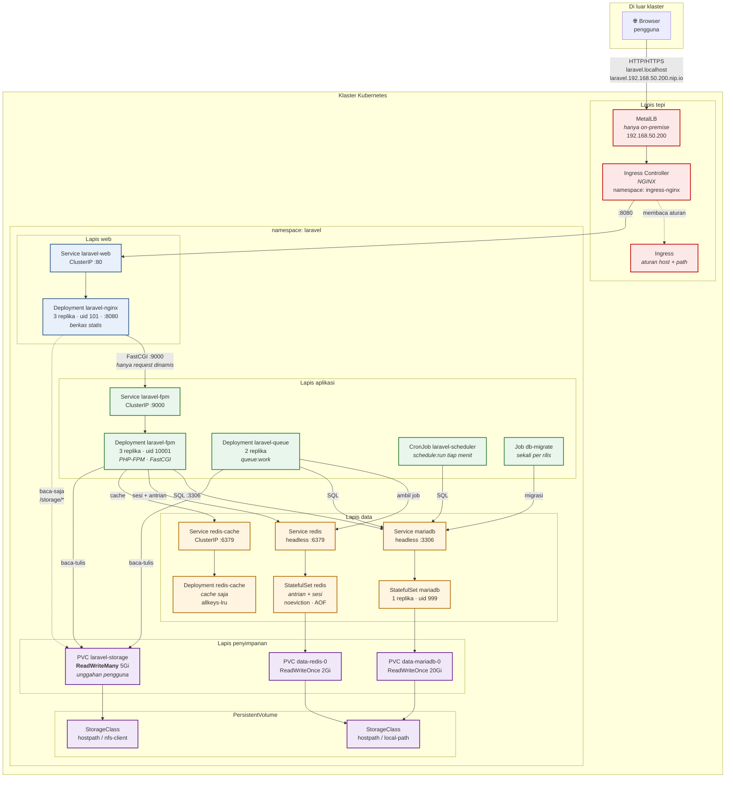

# 1. Arsitektur & Struktur Project

## 1.1 Diagram Arsitektur



### Alur satu permintaan, langkah demi langkah

Menelusuri alur ini sekali dengan tuntas akan membuat sebagian besar sesi
diagnosis di Bab 9 terasa jauh lebih mudah — karena setiap kegagalan pada
dasarnya adalah "macet di langkah nomor berapa".

| # | Langkah | Yang bisa gagal | Gejalanya |
|---|---------|-----------------|-----------|
| 1 | Browser me-resolve nama host | DNS / berkas hosts | `ERR_NAME_NOT_RESOLVED` |
| 2 | Paket sampai ke IP LoadBalancer | MetalLB belum mengumumkan | koneksi timeout |
| 3 | Ingress Controller menerima | tidak ada Pod controller | koneksi ditolak |
| 4 | Controller mencocokkan aturan Ingress | host/path tidak cocok | halaman 404 bawaan controller |
| 5 | Diteruskan ke Service `laravel-web` | selector tidak cocok | **503** |
| 6 | Nginx menerima di :8080 | Pod belum Ready | 503 |
| 7 | Nginx memutuskan: statis atau dinamis | berkas tidak ada | 404 |
| 8 | FastCGI ke `laravel-fpm:9000` | FPM mati/penuh | **502** |
| 9 | PHP mengeksekusi Laravel | error aplikasi | 500 |
| 10 | Laravel menghubungi MariaDB/Redis | kredensial/jaringan | 500 + log koneksi |
| 11 | Respons kembali menyusuri jalur yang sama | PHP lebih lambat dari timeout | **504** |

## 1.2 Fungsi Setiap Komponen

### Lapis tepi

**MetalLB** *(hanya di on-premise)*
Menyediakan apa yang di cloud diberikan penyedia: alamat IP eksternal untuk
Service bertipe LoadBalancer. Tanpa MetalLB, Service semacam itu menampilkan
`EXTERNAL-IP <pending>` selamanya di klaster kubeadm. Di Docker Desktop,
komponen ini tidak diperlukan — Docker Desktop memetakan `localhost` langsung
ke Service LoadBalancer.

**Ingress Controller (NGINX)**
Proses yang benar-benar melayani trafik dari luar. Ia memantau objek Ingress
di seluruh klaster dan menyusun konfigurasi routing-nya sendiri.

**Ingress**
Hanya *aturan*: "host X, path Y, teruskan ke Service Z". Objek ini tidak
melakukan apa pun sendiri. Membuat Ingress tanpa memasang controller
menghasilkan objek valid dengan kolom `ADDRESS` kosong selamanya — dan tidak
ada pesan galat apa pun.

### Lapis web

**Nginx**
Melayani berkas statis (CSS, JS, gambar) langsung dari disk, dan hanya
meneruskan request dinamis ke PHP. Inilah alasan utama ia ada: satu halaman
biasa memicu puluhan request aset, dan tidak satu pun perlu membangunkan
worker PHP.

Ia juga melakukan terminasi koneksi lambat (slow client), kompresi, dan
menegakkan header keamanan.

### Lapis aplikasi

**PHP-FPM**
Menjalankan kode Laravel. Ia **tidak berbicara HTTP** — protokolnya FastCGI
di port 9000. Ini sering mengejutkan: mencoba `curl http://laravel-fpm:9000`
tidak akan pernah menghasilkan halaman, dan itu bukan tanda kerusakan.

**Queue Worker**
Proses panjang yang mengambil job dari Redis dan mengeksekusinya. Memakai
image yang **sama persis** dengan php-fpm — hanya perintahnya berbeda.
Kesamaan image ini menjamin tidak pernah ada selisih versi antara kode web
dan kode worker.

**Scheduler**
CronJob yang memanggil `php artisan schedule:run` setiap menit. Laravel
sendiri yang memutuskan tugas mana yang jatuh tempo.

**Job migrasi**
Berjalan tepat satu kali per rilis, sebelum Pod aplikasi menerima trafik.

### Lapis data

**MariaDB**
Penyimpan kebenaran. Satu-satunya komponen yang datanya benar-benar tidak
tergantikan.

**Redis (antrian + sesi)** — kebijakan `noeviction`, persistensi AOF aktif.
**Redis (cache)** — kebijakan `allkeys-lru`, murni di memori.

> **Kenapa dua Redis?**
> Kebijakan eviction Redis berlaku **per server**, bukan per database.
> Menggabungkan cache dan antrian memaksa memilih satu kebijakan, dan
> keduanya salah: `allkeys-lru` membuat **job antrian hilang tanpa jejak**
> saat memori penuh; `noeviction` membuat cache berhenti berfungsi. Memisahkan
> keduanya menyelesaikan masalah dengan biaya satu Pod kecil.

### Lapis penyimpanan

**PVC `laravel-storage` (ReadWriteMany)**
Berkas unggahan pengguna. Harus RWX karena dibaca-tulis oleh php-fpm dan
queue worker yang tersebar di beberapa Node, dan dibaca Nginx.

Pilihan RWX inilah yang menentukan rekomendasi storage untuk klaster
kubeadm — pembahasannya di [04-storage-jaringan.md](04-storage-jaringan.md).

**PVC `data-mariadb-0` dan `data-redis-0` (ReadWriteOnce)**
Dibuat otomatis oleh `volumeClaimTemplates` StatefulSet.

## 1.3 Keputusan: MariaDB atau MySQL?

**Rekomendasi: MariaDB 11.4 LTS.**

| Pertimbangan | MariaDB 11.4 | MySQL 8.4 |
|---|---|---|
| Dukungan Laravel | Driver `mariadb` tersendiri sejak Laravel 11 | Driver `mysql` (paling lama teruji) |
| Ukuran image | ± 130 MB | ± 240 MB |
| Waktu start container | lebih cepat | lebih lambat |
| Lisensi | GPL murni, satu edisi | GPL + edisi Enterprise terpisah |
| Memori idle | lebih kecil | lebih besar |
| Healthcheck bawaan | `healthcheck.sh` yang benar-benar menguji koneksi | perlu skrip sendiri |

Alasan yang paling menentukan untuk konteks ini:

1. **Dukungan resmi Laravel.** Sejak Laravel 11, `mariadb` adalah driver
   tersendiri, bukan lagi ditumpangkan pada driver MySQL. Perbedaan sintaks
   ditangani framework, bukan ditebak.

2. **Jejak sumber daya lebih kecil.** Di klaster on-premise dengan tiga
   worker, setiap ratus megabita berarti. Waktu start yang lebih cepat juga
   langsung terasa setiap kali Pod dijadwalkan ulang.

3. **Healthcheck yang benar.** Image MariaDB menyediakan `healthcheck.sh`
   yang membuka koneksi sungguhan. Ini penting: `mysqladmin ping` — yang biasa
   dipakai orang — **keluar dengan kode 0 bahkan ketika autentikasi ditolak**,
   sehingga melaporkan sehat pada database yang sebenarnya tidak bisa dipakai.

**Kapan tetap memilih MySQL:** bila organisasi Anda sudah punya perkakas,
prosedur backup, atau kontrak dukungan berbasis MySQL. Perpindahannya kecil —
ganti image ke `mysql:8.4`, ubah nama variabel `MARIADB_*` menjadi `MYSQL_*`,
dan set `DB_CONNECTION=mysql` di ConfigMap.

> **Peringatan berbasis pengalaman:** jangan memakai variabel bernama
> `MYSQL_PWD` untuk menyimpan password aplikasi. Klien `mysql` membacanya
> **secara otomatis** — termasuk selama fase server sementara pada entrypoint
> resmi, ketika root justru belum punya password. Akibatnya inisialisasi
> berhenti di tengah dan meninggalkan datadir setengah jadi yang gejalanya
> sangat sulit ditelusuri.

## 1.4 Struktur Project

```
panduan-laravel-k8s/
├── README.md                     peta panduan + quickstart
├── compose.yaml                  stack pengembangan lokal
├── .env.example                  templat env untuk Compose
├── .dockerignore                 apa yang TIDAK boleh masuk build context
│
├── src/                          ← kode Laravel Anda diletakkan di sini
│
├── docker/
│   ├── php/
│   │   ├── Dockerfile            multi-stage; menghasilkan image php + nginx
│   │   ├── entrypoint.sh         boot idempoten
│   │   ├── php.ini               batas & keamanan
│   │   ├── opcache.ini           setelan OPcache produksi
│   │   ├── www.conf              pool PHP-FPM
│   │   └── fpm-healthcheck       probe FastCGI sungguhan
│   └── nginx/
│       ├── nginx.conf            log JSON, path sementara ke /tmp
│       └── default.conf          vhost aplikasi
│
├── kubernetes/
│   ├── base/                     kebenaran tunggal, tanpa nilai environment
│   │   ├── namespace.yaml        + label Pod Security Admission
│   │   ├── serviceaccount.yaml   role.yaml  rolebinding.yaml
│   │   ├── configmap.yaml        secret.yaml
│   │   ├── pvc.yaml
│   │   ├── statefulset-mariadb.yaml
│   │   ├── statefulset-redis.yaml
│   │   ├── deployment-redis-cache.yaml
│   │   ├── deployment-laravel.yaml
│   │   ├── deployment-nginx.yaml
│   │   ├── deployment-queue.yaml
│   │   ├── cronjob-scheduler.yaml
│   │   ├── job-migrate.yaml
│   │   ├── services.yaml         ingress.yaml  networkpolicy.yaml
│   │   ├── hpa.yaml  pdb.yaml
│   │   ├── resourcequota.yaml  limitrange.yaml
│   │   └── kustomization.yaml
│   └── overlays/
│       ├── docker-desktop/       ← perbedaannya HANYA 4 hal
│       └── onprem/
│
├── infra/                        komponen tingkat klaster (sekali pasang)
│   ├── metallb-config.yaml       kolam IP 192.168.50.200-240
│   └── storage-local-pv.yaml     alternatif Local PV + penjelasannya
│
├── scripts/
│   ├── deploy.sh / deploy.ps1    build → secret → apply → tunggu
│   ├── create-secret.sh          rahasia dibuat di klaster, bukan di Git
│   ├── verify.sh                 daftar periksa yang benar-benar menguji
│   ├── rollback.sh  logs.sh  reset-database.sh
│
├── .github/workflows/deploy.yml  uji → build → pindai → deploy → verifikasi
└── docs/                         panduan ini
```

### Prinsip di balik struktur ini

**`docker/` terpisah dari `src/`.** Kode aplikasi tidak perlu tahu ia
dikemas bagaimana. Anda bisa mengganti seluruh isi `src/` dengan aplikasi
Laravel lain tanpa menyentuh satu baris pun di `docker/` atau `kubernetes/`.

**`base/` tidak pernah berisi nilai spesifik environment.** Tidak ada IP,
tidak ada hostname, tidak ada nama StorageClass, tidak ada tag image
sungguhan. Konsekuensinya `base/` tidak bisa di-apply sendiri sebagai
produksi — ia memang cetakan, bukan environment.

**`infra/` terpisah dari `kubernetes/`.** Isi `infra/` dipasang **sekali per
klaster** oleh administrator (MetalLB, StorageClass, Ingress Controller).
Isi `kubernetes/` di-deploy **setiap rilis** oleh pipeline. Dua siklus hidup
yang berbeda tidak boleh dicampur dalam satu perintah `apply`.

---

Berikutnya: [02-docker.md](02-docker.md)
