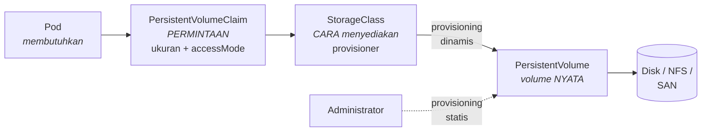

# 4. Persistent Storage, Ingress, dan MetalLB

## 4.1 Konsep Penyimpanan

Empat objek dan hubungannya:



**PersistentVolumeClaim** — permintaan dari sisi aplikasi: "saya butuh 5 GiB
yang bisa ditulis banyak Node". Pengembang menulis ini.

**StorageClass** — resep penyediaan: provisioner mana, parameter apa,
kebijakan apa. Administrator menulis ini, biasanya sekali per klaster.

**PersistentVolume** — volume yang sesungguhnya. Pada provisioning dinamis,
objek ini dibuat otomatis saat PVC muncul.

### AccessMode

| Mode | Arti | Dukungan |
|---|---|---|
| `ReadWriteOnce` (RWO) | baca-tulis oleh Pod di **satu Node** | hampir semua backend |
| `ReadOnlyMany` (ROX) | baca saja, banyak Node | NFS, beberapa CSI |
| `ReadWriteMany` (RWX) | baca-tulis, **banyak Node** | NFS, CephFS, GlusterFS |
| `ReadWriteOncePod` | hanya satu **Pod** | CSI modern (k8s 1.29+) |

> Kesalahpahaman umum: RWO berarti "satu Node", bukan "satu Pod". Beberapa Pod
> di Node yang sama boleh berbagi volume RWO. Yang tidak boleh adalah Pod di
> Node berbeda.

### ReclaimPolicy

| Nilai | Perilaku saat PVC dihapus |
|---|---|
| `Delete` | PV **dan datanya** ikut dihapus. Default provisioning dinamis. |
| `Retain` | PV dipertahankan berisi data, statusnya `Released`, tidak bisa dipakai PVC baru sampai dibersihkan administrator. |

**Peringatan yang penting.** Pada provisioner `hostpath` (Docker Desktop) dan
`local-path`, menghapus PVC **tidak selalu menghapus direktori datanya di
disk**. Provisioner memetakan direktori berdasarkan nama PVC, sehingga PVC
baru bernama sama akan **memakai kembali data lama**.

Gejalanya sangat membingungkan: Anda mengganti `DB_PASSWORD` di Secret,
deploy ulang dari awal, dan MariaDB tetap menolak login — karena tabel
`mysql.user` di datadir lama masih menyimpan password sebelumnya.
Untuk benar-benar mengulang dari nol, pakai
[`scripts/reset-database.sh`](../scripts/reset-database.sh).

## 4.2 Storage di Docker Desktop

Tidak perlu dipasang apa pun. Docker Desktop menyediakan StorageClass
`hostpath` yang sudah menjadi default:

```bash
kubectl get storageclass
# NAME                 PROVISIONER          RECLAIMPOLICY   VOLUMEBINDINGMODE
# hostpath (default)   docker.io/hostpath   Delete          Immediate
```

Karena hanya ada satu Node, `hostpath` secara efektif memenuhi ReadWriteMany —
semua Pod berada di Node yang sama. Ini yang membuat manifest RWX kita jalan
di sini tanpa perubahan.

## 4.3 Storage di Klaster kubeadm — Rekomendasi

**Rekomendasi: NFS dengan provisioner dinamis untuk berkas unggahan, dan
Local Path untuk database.**

### Kenapa dua StorageClass berbeda?

Karena keduanya punya kebutuhan yang bertolak belakang:

| Kebutuhan | Unggahan (`laravel-storage`) | Database (`data-mariadb-0`) |
|---|---|---|
| AccessMode | **RWX wajib** | RWO cukup |
| Pola IO | berkas besar, jarang | acak, kecil, sangat sering |
| Sensitif latensi | tidak | **sangat** |
| Pod harus bisa pindah Node | ya | tidak (StatefulSet tetap di satu Node) |

Menjalankan InnoDB di atas NFS **bisa** dilakukan, tetapi latensi `fsync`
lewat jaringan membuat kinerja tulis anjlok dan menimbulkan risiko korupsi
pada kegagalan jaringan. Database sebaiknya di disk lokal.

Sebaliknya, unggahan **harus** RWX: Pod php-fpm, nginx, dan queue tersebar di
tiga worker dan semuanya harus melihat berkas yang sama.

### Kenapa bukan Local PV untuk semuanya?

Local Persistent Volume punya IO tercepat, tetapi:

- Hanya mendukung **ReadWriteOnce** — tidak bisa memenuhi kebutuhan unggahan.
- **Mengunci Pod ke satu Node.** Kalau Node itu mati, Pod-nya `Pending`
  selamanya dan datanya tidak bisa dijangkau.
- Setiap PV harus dibuat **manual** per Node (tidak ada provisioning dinamis).

Contoh lengkapnya beserta jebakan `volumeBindingMode` ada di
[`infra/storage-local-pv.yaml`](../infra/storage-local-pv.yaml).

### Memasang NFS provisioner

**Langkah 1 — siapkan server NFS.** Idealnya mesin terpisah. Untuk uji coba,
control plane bisa dipakai:

```bash
# Di 192.168.50.14
sudo apt update && sudo apt install -y nfs-kernel-server
sudo mkdir -p /srv/nfs/kubernetes
sudo chown nobody:nogroup /srv/nfs/kubernetes
sudo chmod 777 /srv/nfs/kubernetes

# Hanya subnet klaster yang boleh mengakses
echo '/srv/nfs/kubernetes 192.168.50.0/24(rw,sync,no_subtree_check,no_root_squash)' \
  | sudo tee -a /etc/exports

sudo exportfs -ra
sudo systemctl enable --now nfs-kernel-server
showmount -e localhost
```

> `no_root_squash` diperlukan agar provisioner bisa mengatur kepemilikan
> direktori. Ini melemahkan isolasi, jadi batasi ekspor hanya ke subnet
> klaster — jangan pernah `*`.

**Langkah 2 — pasang klien NFS di SEMUA worker.** Ini yang paling sering
terlupa; tanpa paket ini, Pod macet di `ContainerCreating` dengan pesan
`bad option; for several filesystems (e.g. nfs, cifs) you might need a
/sbin/mount.<type> helper program`:

```bash
for n in 15 16 17; do
  ssh 192.168.50.$n 'sudo apt install -y nfs-common'
done
```

**Langkah 3 — pasang provisioner:**

```bash
helm repo add nfs-subdir-external-provisioner \
  https://kubernetes-sigs.github.io/nfs-subdir-external-provisioner/
helm repo update

helm install nfs-provisioner \
  nfs-subdir-external-provisioner/nfs-subdir-external-provisioner \
  --namespace kube-system \
  --set nfs.server=192.168.50.14 \
  --set nfs.path=/srv/nfs/kubernetes \
  --set storageClass.name=nfs-client \
  --set storageClass.defaultClass=false \
  --set storageClass.accessModes=ReadWriteMany \
  --set storageClass.reclaimPolicy=Retain \
  --set storageClass.archiveOnDelete=true
```

`archiveOnDelete=true` memindahkan direktori ke `archived-<nama>` alih-alih
menghapusnya. Jaring pengaman terhadap `kubectl delete pvc` yang salah ketik.

**Langkah 4 — pasang local-path untuk database:**

```bash
kubectl apply -f https://raw.githubusercontent.com/rancher/local-path-provisioner/v0.0.30/deploy/local-path-storage.yaml
```

**Langkah 5 — verifikasi:**

```bash
kubectl get storageclass
# NAME         PROVISIONER                                     RECLAIMPOLICY
# local-path   rancher.io/local-path                           Delete
# nfs-client   cluster.local/nfs-provisioner-nfs-subdir-...    Retain

# Uji RWX sungguhan: dua Pod di Node berbeda menulis ke volume yang sama
kubectl apply -f - <<'EOF'
apiVersion: v1
kind: PersistentVolumeClaim
metadata: { name: uji-rwx }
spec:
  accessModes: ["ReadWriteMany"]
  storageClassName: nfs-client
  resources: { requests: { storage: 1Gi } }
EOF

kubectl get pvc uji-rwx      # harus Bound
kubectl delete pvc uji-rwx
```

## 4.4 Ingress Controller

> **Catatan status proyek (per pertengahan 2026).**
> Proyek komunitas **Ingress-NGINX telah memasuki masa pensiun**; pengembangan
> fitur baru dihentikan dan penggantinya diarahkan ke **Gateway API**
> (v1.6 sudah GA) atau ke proyek penerus **InGate**.
>
> Panduan ini tetap memakai Ingress-NGINX sesuai permintaan, dan
> instalasinya di-pin ke rilis tertentu supaya reproducible. Untuk klaster
> baru yang akan hidup lama, pertimbangkan Gateway API — migrasinya
> disinggung di akhir bagian ini. **Periksa status terkini proyeknya sebelum
> memakai untuk produksi baru.**

### Di Docker Desktop

```bash
kubectl apply -f https://raw.githubusercontent.com/kubernetes/ingress-nginx/controller-v1.12.0/deploy/static/provider/cloud/deploy.yaml

kubectl -n ingress-nginx rollout status deployment/ingress-nginx-controller --timeout=180s

kubectl -n ingress-nginx get svc
# NAME                       TYPE           EXTERNAL-IP   PORT(S)
# ingress-nginx-controller   LoadBalancer   localhost     80:31234/TCP,443:31967/TCP
```

Manifest `provider/cloud` dipakai karena Docker Desktop **memang** memenuhi
Service LoadBalancer: ia memetakannya ke `localhost` di mesin Anda. Karena itu
`http://laravel.localhost` langsung bisa dibuka tanpa mengedit berkas hosts —
semua sistem operasi modern me-resolve `*.localhost` ke `127.0.0.1`.

### Di klaster kubeadm

Perbedaan penting: pakai varian **`baremetal`**, dan deploy sebagai
**DaemonSet** agar setiap worker bisa menerima trafik.

```bash
kubectl apply -f https://raw.githubusercontent.com/kubernetes/ingress-nginx/controller-v1.12.0/deploy/static/provider/baremetal/deploy.yaml

# Ubah menjadi DaemonSet supaya ada controller di setiap worker.
# Ini prasyarat externalTrafficPolicy: Local pada Service MetalLB.
kubectl -n ingress-nginx patch deployment ingress-nginx-controller \
  --type=json -p='[{"op":"replace","path":"/spec/replicas","value":3}]'

# Setelah MetalLB terpasang, ganti Service-nya menjadi LoadBalancer
kubectl apply -f infra/metallb-config.yaml

kubectl -n ingress-nginx get svc ingress-nginx-controller
# EXTERNAL-IP harus 192.168.50.200
```

### Menguji

```bash
curl -H 'Host: laravel.192.168.50.200.nip.io' http://192.168.50.200/up
# harus 200
```

### Bermigrasi ke Gateway API (opsional)

```bash
kubectl apply -f https://github.com/kubernetes-sigs/gateway-api/releases/download/v1.6.0/standard-install.yaml
kubectl wait --for=condition=established crd/gateways.gateway.networking.k8s.io
```

> **Jebakan yang pasti Anda temui:** menerapkan CRD dan objeknya dalam satu
> perintah akan gagal dengan `the server could not find the requested
> resource`. Pendaftaran jenis baru butuh waktu sesaat untuk menyebar ke
> discovery API. Selalu `kubectl wait --for=condition=established crd/...`
> di antara keduanya.

Padanan Ingress kita dalam Gateway API:

```yaml
apiVersion: gateway.networking.k8s.io/v1
kind: HTTPRoute
metadata:
  name: laravel
spec:
  parentRefs:
    - name: gateway-utama
  hostnames: ["laravel.192.168.50.200.nip.io"]
  rules:
    - backendRefs:
        - name: laravel-web
          port: 80
```

## 4.5 MetalLB

Berkas: [`infra/metallb-config.yaml`](../infra/metallb-config.yaml)

### Kenapa dibutuhkan

Service bertipe LoadBalancer meminta IP eksternal kepada penyedia cloud. Di
klaster on-premise tidak ada penyedia cloud, jadi permintaan itu tidak pernah
dijawab dan Service menampilkan `EXTERNAL-IP <pending>` selamanya.

MetalLB mengisi peran itu. Dalam mode Layer 2, satu Node "mengaku" sebagai
pemilik IP tersebut lewat balasan ARP, sehingga perangkat lain di LAN
mengirim paket ke Node itu.

### Instalasi

```bash
# 1. Controller
kubectl apply -f https://raw.githubusercontent.com/metallb/metallb/v0.14.9/config/manifests/metallb-native.yaml
kubectl -n metallb-system rollout status deployment/controller --timeout=180s
kubectl -n metallb-system rollout status daemonset/speaker --timeout=180s

# 2. Beri label pada worker (dipakai nodeSelector di L2Advertisement)
for n in 15 16 17; do
  kubectl label node $(kubectl get node -o name | grep -E "worker|$n" | head -1) \
    node-role.kubernetes.io/worker="" --overwrite
done

# 3. Konfigurasi kolam alamat
kubectl apply -f infra/metallb-config.yaml
```

### Pemilihan rentang IP — bagian paling kritis

```
192.168.50.14   control plane
192.168.50.15   worker 1
192.168.50.16   worker 2
192.168.50.17   worker 3
──────────────────────────────
192.168.50.200 – 192.168.50.240   ← kolam MetalLB
```

Rentang dimulai dari `.200` sehingga tidak menyentuh IP node dan menyisakan
`.1`–`.199` untuk gateway serta perangkat statis lain.

**Tiga hal yang wajib diperiksa sebelum menerapkan:**

1. **Keluarkan rentang ini dari kolam DHCP router.** Bila tidak, suatu hari
   router akan memberikan `192.168.50.205` ke laptop seseorang dan dua
   perangkat memperebutkan IP yang sama. Gejalanya: layanan kadang bisa
   diakses, kadang tidak — dan tidak ada apa pun di log Kubernetes yang
   menunjukkan penyebabnya.

2. **Pastikan tidak ada yang sedang memakainya:**

   ```bash
   nmap -sn 192.168.50.200-240
   # atau dari salah satu node:
   for i in $(seq 200 240); do
     ping -c1 -W1 192.168.50.$i >/dev/null 2>&1 && echo "TERPAKAI: .$i"
   done
   ```

3. **Semua node harus di broadcast domain L2 yang sama** dengan rentang ini.
   MetalLB mode L2 bekerja lewat ARP, dan ARP tidak melewati router.

### L2 atau BGP?

| | Layer 2 | BGP |
|---|---|---|
| Konfigurasi router | tidak perlu | wajib |
| Distribusi trafik | satu Node per IP | benar-benar terbagi |
| Failover | beberapa detik (ARP) | sub-detik |
| Cocok untuk | klaster kecil–menengah | produksi berskala besar |

Untuk klaster empat Node seperti ini, **L2 adalah pilihan yang tepat**.

### Jebakan: `L2Advertisement` yang terlupa

`IPAddressPool` mengalokasikan alamat; `L2Advertisement` yang
**mengumumkannya**. Tanpa objek kedua, Service tampak sudah punya
`EXTERNAL-IP` tetapi tetap tidak bisa dijangkau dari LAN. Karena Service-nya
terlihat normal, kesalahan ini bisa memakan waktu lama untuk ditemukan.

### `externalTrafficPolicy: Local`

```yaml
externalTrafficPolicy: Local
```

Dengan `Cluster` (default), kube-proxy boleh meneruskan paket ke Node lain
dan melakukan SNAT — akibatnya **semua** pengunjung terlihat berasal dari IP
Node. Rate limiting, geolokasi, dan log audit menjadi tidak berguna.

Harga dari `Local`: trafik hanya dilayani Node yang punya Pod controller.
Karena itulah Ingress Controller di-deploy dengan replika di setiap worker.

---

Berikutnya: [05-laravel-operasional.md](05-laravel-operasional.md)
