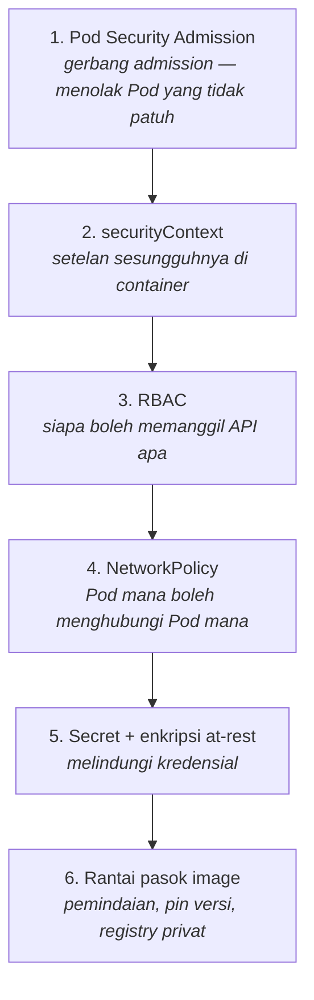

# 6. Resource, Keamanan, dan Pengelolaan Environment

## 6.1 Resource: requests dan limits

### Perbedaan yang menentukan segalanya

**`requests`** = kapasitas yang **dipesan**. Ini yang dipakai scheduler untuk
memutuskan Node mana yang muat. Node yang "terlihat kosong" di `kubectl top`
tetap bisa menolak Pod baru karena requests-nya sudah penuh dipesan.

**`limits`** = plafon pemakaian. Perlakuannya berbeda antara dua resource:

| | CPU | Memori |
|---|---|---|
| Sifat | *compressible* | *incompressible* |
| Melampaui limit | di-**throttle** (melambat) | container **OOMKilled** |
| Bisa dipulihkan? | ya, otomatis | tidak, harus restart |

Perbedaan ini menghasilkan dua aturan praktis yang berbeda:

- **Memori: limit = request.** Memberi limit lebih besar dari request berarti
  Pod "meminjam" memori yang tidak dijamin ada — dan akan dibunuh sewaktu-waktu
  saat Node menjadi padat.
- **CPU: limit boleh jauh di atas request** (atau bahkan tidak ada). CPU
  throttling pada PHP-FPM langsung terasa sebagai latensi bagi pengguna, dan
  tidak ada bahayanya membiarkan Pod memakai CPU menganggur.

### Kelas QoS

Kubernetes menggolongkan Pod, dan golongan ini menentukan **urutan pengusiran**
saat Node kehabisan memori:

| Kelas | Syarat | Diusir ke- |
|---|---|---|
| `Guaranteed` | requests = limits untuk **semua** resource di **semua** container | terakhir |
| `Burstable` | ada requests, tetapi tidak sama dengan limits | kedua |
| `BestEffort` | tanpa requests maupun limits | **pertama** |

Di stack ini, MariaDB dan Redis sengaja dibuat `Guaranteed` (memory
request = limit) — keduanya adalah komponen terakhir yang boleh diusir.

```bash
kubectl -n laravel get pods -o custom-columns=\
NAMA:.metadata.name,QOS:.status.qosClass
```

### Rekomendasi produksi

| Komponen | CPU req | CPU limit | Mem req | Mem limit | QoS |
|---|---|---|---|---|---|
| PHP-FPM | 250m | 1000m | 384Mi | 512Mi | Burstable |
| Nginx | 50m | 500m | 64Mi | 128Mi | Burstable |
| Queue worker | 100m | 1000m | 256Mi | 512Mi | Burstable |
| Scheduler | 50m | 500m | 192Mi | 384Mi | Burstable |
| MariaDB | 500m | 2000m | 1536Mi | 1536Mi | **Guaranteed** |
| Redis (antrian) | 100m | 500m | 640Mi | 640Mi | **Guaranteed** |
| Redis (cache) | 50m | 500m | 320Mi | 320Mi | **Guaranteed** |

Beberapa angka yang saling terkait dan **harus diubah bersama-sama**:

- `innodb-buffer-pool-size` (1G) harus ± 60–70% dari memory limit MariaDB.
  Menurunkan limit tanpa menurunkan buffer pool membuat MariaDB gagal start.
- `maxmemory` Redis (512mb) + ruang untuk buffer AOF = memory limit (640Mi).
- `memory_limit` PHP (256M) × `pm.max_children` adalah plafon teoretis, tetapi
  pemakaian nyata Laravel ~40–80 MB per worker.

### Menentukan angka sendiri

Jangan menebak. Ukur:

```bash
# Pasang metrics-server (tidak ada secara default di Docker Desktop maupun kubeadm)
kubectl apply -f https://github.com/kubernetes-sigs/metrics-server/releases/latest/download/components.yaml

# Docker Desktop dan kubeadm dengan sertifikat kubelet self-signed
# membutuhkan flag ini, kalau tidak metrics-server CrashLoopBackOff:
kubectl -n kube-system patch deployment metrics-server --type=json \
  -p='[{"op":"add","path":"/spec/template/spec/containers/0/args/-","value":"--kubelet-insecure-tls"}]'

kubectl -n laravel top pods --sort-by=memory
```

Aturan praktis: **requests = P50 pemakaian nyata**, **limits = P99 × 1,3**.

### ResourceQuota dan LimitRange bekerja berpasangan

Begitu ResourceQuota membatasi cpu/memory, **setiap** container di namespace
wajib punya requests dan limits — Pod tanpa keduanya akan ditolak.

LimitRange yang menyelamatkan: ia mengisi default sehingga Pod sederhana
seperti `kubectl run uji --image=busybox` tetap bisa dibuat.

## 6.2 Keamanan Berlapis

Klaster baru sengaja dibuat longgar agar mudah dimulai. Setiap lapis di bawah
harus dinyalakan sendiri.



### 1. Pod Security Admission

Menggantikan PodSecurityPolicy yang dihapus di Kubernetes v1.25. Diaktifkan
murni lewat label namespace:

```yaml
pod-security.kubernetes.io/enforce: restricted
pod-security.kubernetes.io/audit: restricted
pod-security.kubernetes.io/warn: restricted
```

Profil `restricted` menolak Pod yang tidak memenuhi: `runAsNonRoot`,
`allowPrivilegeEscalation: false`, `capabilities.drop: ["ALL"]`,
`seccompProfile: RuntimeDefault`, tanpa `hostPath`/`hostNetwork`/`hostPID`.

**Manfaatnya:** kesalahan konfigurasi keamanan ditolak saat `apply` — bukan
ditemukan berbulan-bulan kemudian saat audit.

Cara menerapkan pada namespace yang sudah berisi beban kerja: mulai dengan
`warn` dan `audit` saja untuk melihat apa yang akan ditolak, baru naikkan ke
`enforce`.

```bash
# Melihat apa yang akan ditolak, tanpa memblokir apa pun
kubectl label ns laravel pod-security.kubernetes.io/warn=restricted --overwrite
kubectl -n laravel rollout restart deployment/laravel-fpm
```

### 2. securityContext

| Setelan | Manfaat | Konsekuensi |
|---|---|---|
| `runAsNonRoot: true` | eksploitasi tidak langsung mendapat root | image harus mendukung |
| `runAsUser: 10001` | UID konsisten antar-Node | harus cocok dengan `fsGroup` |
| `allowPrivilegeEscalation: false` | memblokir `setuid`/`setcap` | — |
| `readOnlyRootFilesystem: true` | penyerang tidak bisa menulis webshell | butuh emptyDir untuk path writable |
| `capabilities.drop: ["ALL"]` | hilangkan semua hak istimewa kernel | tidak bisa bind port <1024 |
| `seccompProfile: RuntimeDefault` | blokir ~44 syscall berbahaya | — |
| `fsGroup: 10001` | volume bisa ditulis proses non-root | — |

`readOnlyRootFilesystem` adalah yang paling banyak berdampak dan paling
banyak menimbulkan kejutan. Semua path yang perlu ditulis harus dipetakan:

| Path | Volume |
|---|---|
| `/tmp` | emptyDir |
| `storage/framework` | emptyDir (per-Pod) |
| `bootstrap/cache` | emptyDir (per-Pod) |
| `storage/app/public` | PVC RWX (dibagi) |
| `/var/cache/nginx`, `/tmp` (Nginx) | emptyDir |

`storage/logs` tidak perlu — `LOG_CHANNEL=stderr` mengalirkan log ke stdout.

**Membuktikannya bekerja:**

```bash
POD=$(kubectl -n laravel get pod -l app.kubernetes.io/name=laravel-fpm -o name | head -1)
kubectl -n laravel exec $POD -c php-fpm -- id
# uid=10001(app) gid=10001(app)

kubectl -n laravel exec $POD -c php-fpm -- touch /root-tidak-boleh
# touch: /root-tidak-boleh: Read-only file system   ← benar
```

### 3. RBAC

Prinsip hak seminimal mungkin, diterapkan sampai ekstrem: ServiceAccount
`laravel` yang dipakai Pod aplikasi **tidak ditautkan ke Role apa pun**, dan
tokennya tidak dipasang sama sekali (`automountServiceAccountToken: false`).

Aplikasi Laravel memang tidak pernah memanggil API Kubernetes. Menghilangkan
kredensial klaster dari dalam container berarti satu celah RCE tidak berubah
menjadi pijakan untuk berbicara dengan API server.

Perhatikan juga bahwa Role `laravel-readonly` **sengaja tidak menyertakan
`secrets`**. Secret sudah di-inject sebagai variabel lingkungan oleh kubelet;
memberi hak `get secrets` berarti satu celah bisa membocorkan seluruh
kredensial namespace.

**Verifikasi:**

```bash
kubectl auth can-i list pods   -n laravel --as=system:serviceaccount:laravel:laravel-ops  # yes
kubectl auth can-i get secrets -n laravel --as=system:serviceaccount:laravel:laravel-ops  # no
kubectl auth can-i list pods   -n laravel --as=system:serviceaccount:laravel:laravel      # no
```

### 4. NetworkPolicy

Pola default-deny + izin eksplisit, tujuh policy di
[`networkpolicy.yaml`](../kubernetes/base/networkpolicy.yaml).

**Kesalahan nomor satu:** memasang default-deny egress lalu lupa mengizinkan
DNS. Semua koneksi gagal dengan galat resolusi nama yang terlihat seperti
masalah lain sama sekali. Policy `allow-dns` ada khusus untuk itu.

> **Peringatan untuk Docker Desktop.**
> NetworkPolicy hanya **ditegakkan** bila CNI-nya mendukung (Calico, Cilium).
> CNI bawaan Docker Desktop **tidak menegakkannya**: objeknya tersimpan rapi
> dan `kubectl get netpol` menampilkannya, tetapi lalu lintasnya tetap lewat.
>
> Ini sudah diuji langsung — sebuah Pod tanpa label yang diizinkan tetap
> berhasil membuka koneksi ke `mariadb:3306`.
>
> **Jangan pernah memvalidasi kebijakan jaringan di Docker Desktop lalu
> menganggapnya terbukti.**

**Cara menguji dengan benar (di klaster kubeadm dengan Calico/Cilium):**

```bash
# Pod tanpa label yang diizinkan — HARUS gagal
kubectl -n laravel run penyusup --rm -it --restart=Never \
  --image=busybox:1.37 --labels='app=penyusup' \
  --overrides='{"spec":{"securityContext":{"runAsNonRoot":true,"runAsUser":10001,"seccompProfile":{"type":"RuntimeDefault"}}}}' \
  -- sh -c 'nc -zv -w3 mariadb 3306; echo "kode keluar: $?"'
# Diharapkan: timeout, kode keluar != 0

# Pod dengan label yang diizinkan — HARUS berhasil
kubectl -n laravel run sah --rm -it --restart=Never \
  --image=busybox:1.37 --labels='app.kubernetes.io/name=laravel-fpm' \
  -- sh -c 'nc -zv -w3 mariadb 3306'
```

### 5. Secret

Secret Kubernetes hanya di-encode base64 — itu **penyandian, bukan
enkripsi**:

```bash
kubectl -n laravel get secret laravel-secret -o jsonpath='{.data.DB_PASSWORD}' | base64 -d
```

Tiga lapis perlindungan yang sesungguhnya:

**a. RBAC ketat** pada resource `secrets` (sudah diterapkan di atas).

**b. Enkripsi at-rest di etcd.** Tanpa ini, siapa pun yang mendapat snapshot
etcd mendapat semua password dalam bentuk terbaca:

```yaml
# /etc/kubernetes/enc/enc.yaml di control plane (192.168.50.14)
apiVersion: apiserver.config.k8s.io/v1
kind: EncryptionConfiguration
resources:
  - resources: ["secrets"]
    providers:
      - aescbc:
          keys:
            - name: kunci1
              secret: <head -c 32 /dev/urandom | base64>
      - identity: {}      # harus terakhir; memungkinkan baca data lama
```

Tambahkan `--encryption-provider-config` ke
`/etc/kubernetes/manifests/kube-apiserver.yaml`, lalu enkripsi ulang Secret
yang sudah ada:

```bash
kubectl get secrets -A -o json | kubectl replace -f -
```

**c. Jangan pernah menyimpan rahasia di Git.** Tiga pilihan:

| Pendekatan | Cara kerja | Cocok untuk |
|---|---|---|
| **Sealed Secrets** | dienkripsi dengan kunci publik controller; aman di-commit | GitOps, tim kecil–menengah |
| **External Secrets Operator** | rahasia tetap di Vault/AWS SM, disinkronkan saat runtime | organisasi dengan manajemen rahasia terpusat |
| **SOPS + age** | enkripsi berbasis berkas | tim kecil |

Contoh Sealed Secrets:

```bash
helm install sealed-secrets sealed-secrets/sealed-secrets -n kube-system

kubectl -n laravel create secret generic laravel-secret \
  --from-literal=APP_KEY="base64:$(openssl rand -base64 32)" \
  --dry-run=client -o yaml \
  | kubeseal --format yaml > kubernetes/overlays/onprem/sealed-secret.yaml
# Berkas ini AMAN di-commit — hanya controller di klaster tujuan yang bisa membukanya
```

### 6. Rantai pasok image

**`imagePullPolicy`:**

| Nilai | Kapan | Catatan |
|---|---|---|
| `IfNotPresent` | Docker Desktop, tag unik | image lokal langsung dipakai |
| `Always` | produksi | menjamin versi benar meski tag pernah ditimpa |
| `Never` | uji offline | gagal bila image tidak ada di Node |

**Jebakan:** tag `latest` memicu `Always` secara implisit. Di Docker Desktop,
itu berarti Kubernetes mencari image di Docker Hub dan gagal dengan
`ImagePullBackOff` — meskipun image-nya ada di daemon lokal. Karena itu
overlay development memakai tag `dev`, bukan `latest`.

**`imagePullSecrets`** untuk registry privat:

```bash
kubectl -n laravel create secret docker-registry ghcr-creds \
  --docker-server=ghcr.io \
  --docker-username=<user> \
  --docker-password=<token-dengan-scope-read:packages>
```

**Pemindaian** dijalankan di pipeline sebelum deploy — lihat
[07-cicd-monitoring.md](07-cicd-monitoring.md).

## 6.3 Pengelolaan Environment

### Tiga tempat konfigurasi, tiga tujuan berbeda

| Tempat | Isi | Dipakai oleh |
|---|---|---|
| `.env` | konfigurasi lokal | **hanya** Docker Compose |
| ConfigMap | nilai non-rahasia per environment | Kubernetes |
| Secret | kredensial | Kubernetes |

**Container produksi tidak punya berkas `.env` sama sekali** — dan itu
disengaja. Satu berkas `.env` yang terbawa ke image berarti kredensial
produksi ikut tersebar ke setiap Node yang menarik image itu.

Laravel membaca `$_ENV` bila `.env` tidak ada, jadi injeksi lewat `envFrom`
bekerja tanpa perubahan kode apa pun.

### Aturan pemisahan

> Apa pun yang boleh terlihat orang lain saat Anda berbagi layar masuk
> **ConfigMap**. Sisanya masuk **Secret**.

### Masalah: ConfigMap berubah, Pod tidak tahu

Variabel lingkungan hanya dibaca **saat container start**. Mengubah ConfigMap
tidak berdampak apa pun sampai Pod kebetulan di-restart.

Dua solusi:

**a. Anotasi checksum** (dipakai `deploy.sh`):

```bash
HASH=$(kubectl -n laravel get cm laravel-config -o yaml | sha256sum | cut -c1-16)
kubectl -n laravel patch deployment laravel-fpm \
  -p "{\"spec\":{\"template\":{\"metadata\":{\"annotations\":{\"checksum/config\":\"$HASH\"}}}}}"
```

Template Pod berubah → Deployment melakukan rolling update otomatis.

**b. `configMapGenerator` Kustomize** — menambahkan hash isi ke **nama**
objek:

```yaml
configMapGenerator:
  - name: laravel-config
    envs: [config/app.env]
# menghasilkan: laravel-config-6ct58g7mhd
```

Isi berubah → nama berubah → referensi di Deployment berubah → rollout.
Lebih elegan, tetapi meninggalkan ConfigMap lama yang harus dibersihkan
berkala.

### Nilai per environment

Dikelola sepenuhnya lewat patch overlay:

| Kunci | Base | docker-desktop | onprem |
|---|---|---|---|
| `APP_ENV` | production | local | production |
| `APP_DEBUG` | false | **true** | false |
| `APP_URL` | laravel.local | laravel.localhost | laravel.192.168.50.200.nip.io |
| `LOG_LEVEL` | info | debug | info |

> `APP_DEBUG=true` di produksi akan menampilkan **stack trace lengkap beserta
> isi variabel lingkungan** — termasuk password database — kepada siapa pun
> yang memicu error. Ini kebocoran kredensial paling umum pada aplikasi
> Laravel.

---

Berikutnya: [07-cicd-monitoring.md](07-cicd-monitoring.md)
