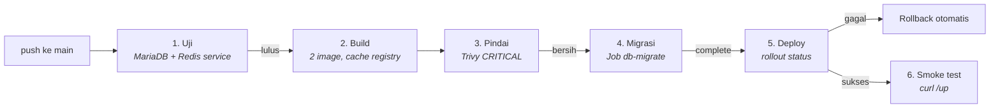

# 7. CI/CD dan Monitoring

## 7.1 Pipeline GitHub Actions

Berkas: [`.github/workflows/deploy.yml`](../.github/workflows/deploy.yml)



### Tiga prinsip yang dipegang

**1. Satu commit = satu tag image yang unik dan permanen.**

```yaml
TAG="sha-$(git rev-parse --short HEAD)"
```

Tanpa tag unik, tidak ada yang bisa disebut "versi sebelumnya" saat rollback.
`latest` di produksi menghilangkan kemampuan itu sepenuhnya.

**2. Image yang di-deploy adalah image yang diuji.** Tidak ada rebuild di
antara pengujian dan deploy.

**3. Pipeline gagal bila rollout gagal.** Ini yang paling sering terlewat —
`kubectl apply` mengembalikan sukses segera setelah objek diterima API server,
**jauh sebelum** Pod baru benar-benar berjalan. Tanpa gerbang di bawah,
pipeline akan berwarna hijau meski aplikasinya `CrashLoopBackOff`:

```yaml
- run: kubectl -n laravel rollout status deployment/laravel-fpm --timeout=600s
```

### Penjelasan langkah per langkah

**Job `uji`.** Menjalankan pengujian dengan MariaDB dan Redis sebagai
*service container*. Dijalankan lebih dulu supaya tidak ada image yang
dibangun bila pengujiannya gagal.

Cache Composer memakai kunci berbasis `hashFiles('src/composer.lock')` —
bukan nomor run. Cache dipakai ulang selama dependensinya tidak berubah.

**Job `build`.** Dua image dari Dockerfile yang sama (`--target php` dan
`--target nginx`).

Cache lintas-run disimpan di registry:

```yaml
cache-from: type=registry,ref=ghcr.io/.../laravel-php:buildcache
cache-to:   type=registry,ref=ghcr.io/.../laravel-php:buildcache,mode=max
```

Tanpa ini, setiap build mengunduh dan mengompilasi ulang seluruh ekstensi PHP
(~3 menit terbuang setiap kali).

Pada pull request, langkah login dan push dilewati — PR dari fork tidak punya
(dan tidak boleh punya) kredensial registry.

**Pemindaian Trivy** dengan `exit-code: 1` pada severity `CRITICAL`
menghentikan pipeline sebelum image cacat sampai ke klaster.
`ignore-unfixed: true` mencegah pipeline gagal karena CVE yang memang belum
ada perbaikannya.

**Job `deploy`.** Migrasi dijalankan dan **ditunggu sampai selesai** sebelum
rollout — aplikasi versi baru bisa saja mengandalkan kolom yang belum ada.

`kubectl diff` ditampilkan sebagai pratinjau. `|| true` diperlukan karena
`kubectl diff` keluar dengan kode 1 ketika **memang ada** perbedaan — itu
keadaan normal, bukan galat.

### Kredensial deploy — jangan pakai admin.conf

`secrets.KUBE_CONFIG` sebaiknya berisi kubeconfig milik ServiceAccount khusus
dengan hak terbatas, bukan `admin.conf` klaster.

```bash
kubectl -n laravel create serviceaccount deployer

kubectl -n laravel create role deployer \
  --verb=get,list,watch,create,update,patch,delete \
  --resource=deployments,statefulsets,jobs,cronjobs,pods,services,configmaps,ingresses

kubectl -n laravel create rolebinding deployer \
  --role=deployer --serviceaccount=laravel:deployer

# Token berumur pendek (Kubernetes 1.24+ tidak lagi membuat token permanen)
TOKEN=$(kubectl -n laravel create token deployer --duration=8760h)
CA=$(kubectl config view --raw -o jsonpath='{.clusters[0].cluster.certificate-authority-data}')

cat > deployer.conf <<EOF
apiVersion: v1
kind: Config
clusters:
- cluster: { certificate-authority-data: $CA, server: https://192.168.50.14:6443 }
  name: klaster
contexts:
- context: { cluster: klaster, namespace: laravel, user: deployer }
  name: deployer
current-context: deployer
users:
- name: deployer
  user: { token: $TOKEN }
EOF

base64 -w0 deployer.conf     # salin hasilnya ke secret KUBE_CONFIG
rm deployer.conf
```

Perhatikan bahwa `deployer` **tidak** diberi hak atas `secrets` — rahasia
dikelola terpisah lewat Sealed Secrets atau External Secrets, bukan oleh
pipeline.

### Klaster on-premise tidak terjangkau dari internet

GitHub Actions berjalan di cloud dan tidak bisa menjangkau `192.168.50.14`.
Tiga pilihan:

| Pendekatan | Cara kerja | Catatan |
|---|---|---|
| **Self-hosted runner** | runner dipasang di dalam jaringan Anda | paling sederhana |
| **GitOps (Argo CD / Flux)** | agen di klaster yang *menarik* dari Git | **rekomendasi** — tidak perlu membuka akses masuk sama sekali |
| **VPN / tunnel** | Tailscale, WireGuard | menambah komponen |

GitOps adalah yang paling aman: arah koneksinya keluar dari klaster, sehingga
tidak ada satu pun port yang perlu dibuka ke internet.

## 7.2 Monitoring dan Observabilitas

### Tiga pilar

| Pilar | Menjawab | Perkakas di sini |
|---|---|---|
| **Metrik** | "berapa banyak, seberapa cepat" | Prometheus + Grafana |
| **Log** | "apa yang terjadi pada request ini" | stdout → Loki |
| **Trace** | "waktunya habis di mana" | OpenTelemetry (opsional) |

### Memasang kube-prometheus-stack

```bash
helm repo add prometheus-community https://prometheus-community.github.io/helm-charts
helm repo update

helm install monitoring prometheus-community/kube-prometheus-stack \
  --namespace monitoring --create-namespace \
  --set grafana.adminPassword='ganti-saya' \
  --set prometheus.prometheusSpec.retention=15d \
  --set prometheus.prometheusSpec.storageSpec.volumeClaimTemplate.spec.storageClassName=local-path \
  --set prometheus.prometheusSpec.storageSpec.volumeClaimTemplate.spec.resources.requests.storage=20Gi \
  --set prometheus.prometheusSpec.podMonitorSelectorNilUsesHelmValues=false \
  --set prometheus.prometheusSpec.serviceMonitorSelectorNilUsesHelmValues=false
```

Dua flag terakhir penting: tanpa keduanya, Prometheus **hanya** mengambil
ServiceMonitor milik rilis Helm-nya sendiri dan mengabaikan milik kita.

```bash
kubectl -n monitoring port-forward svc/monitoring-grafana 3000:80
# http://localhost:3000  (admin / ganti-saya)
```

### Exporter sebagai sidecar

Metrik PHP-FPM diambil dari `pm.status_path` yang sudah diaktifkan di
[`www.conf`](../docker/php/www.conf):

```yaml
# patch-monitoring.yaml
apiVersion: apps/v1
kind: Deployment
metadata:
  name: laravel-fpm
spec:
  template:
    metadata:
      labels:
        monitoring: enabled
    spec:
      containers:
        - name: fpm-exporter
          image: hipages/php-fpm_exporter:2.2.0
          env:
            - name: PHP_FPM_SCRAPE_URI
              value: tcp://127.0.0.1:9000/fpm-status
          ports:
            - { name: metrics, containerPort: 9253 }
          resources:
            requests: { cpu: "10m", memory: "24Mi" }
            limits:   { cpu: "100m", memory: "48Mi" }
          securityContext:
            allowPrivilegeEscalation: false
            readOnlyRootFilesystem: true
            runAsNonRoot: true
            runAsUser: 10001
            capabilities: { drop: ["ALL"] }
```

Exporter lain yang berguna: `nginx/nginx-prometheus-exporter`,
`prom/mysqld-exporter`, `oliver006/redis_exporter`.

### ServiceMonitor

```yaml
apiVersion: monitoring.coreos.com/v1
kind: ServiceMonitor
metadata:
  name: laravel-fpm
  namespace: laravel
spec:
  selector:
    matchLabels:
      app.kubernetes.io/name: laravel-fpm
  endpoints:
    - port: metrics
      interval: 30s
```

### Metrik yang benar-benar perlu dipantau

| Metrik | Ambang | Artinya |
|---|---|---|
| `phpfpm_active_processes / phpfpm_total_processes` | > 80% | pool hampir penuh → **502 sudah dekat** |
| `phpfpm_max_children_reached` | naik sama sekali | `pm.max_children` kekecilan |
| `phpfpm_slow_requests` | naik | ada query/kode lambat |
| `nginx_http_requests_total{status=~"5.."}` | > 1% | error rate |
| `mysql_global_status_threads_connected / max_connections` | > 80% | connection pool hampir habis |
| `redis_memory_used_bytes / redis_memory_max_bytes` | > 90% | eviction akan mulai |
| `kube_pod_container_status_restarts_total` | naik | probe terlalu ketat, atau OOMKill |

Yang pertama layak diperhatikan khusus: **saturasi pool PHP-FPM adalah
peringatan dini paling berguna untuk 502**. Saat semua worker sibuk, request
berikutnya antre lalu ditolak — dan Nginx melaporkannya sebagai 502.

### Log

Semua komponen sudah dikonfigurasi menulis ke stdout/stderr dalam format
JSON:

- **Laravel** — `LOG_CHANNEL=stderr` + `JsonFormatter`
- **Nginx** — `log_format json` di [`nginx.conf`](../docker/nginx/nginx.conf)
- **PHP-FPM** — `error_log = /dev/stderr`, `catch_workers_output = yes`

Menulis log ke berkas di dalam container adalah kesalahan: berkasnya ikut
hilang saat Pod dihapus, dan tidak pernah terbaca `kubectl logs`.

Format Nginx sengaja menyertakan `request_time` **dan**
`upstream_response_time` — keduanya memisahkan "lambat karena jaringan" dari
"lambat karena PHP", pembeda yang menentukan saat mengejar 504.

**Agregasi dengan Loki:**

```bash
helm repo add grafana https://grafana.github.io/helm-charts
helm install loki grafana/loki-stack \
  --namespace monitoring \
  --set promtail.enabled=true \
  --set loki.persistence.enabled=true \
  --set loki.persistence.storageClassName=local-path \
  --set loki.persistence.size=20Gi
```

Contoh kueri LogQL:

```logql
# Semua error aplikasi
{namespace="laravel", container="php-fpm"} | json | level="error"

# Request yang lebih lambat dari 1 detik
{namespace="laravel", container="nginx"} | json | upstream_time > 1

# Laju error 5xx per menit
sum(rate({namespace="laravel"} | json | status >= 500 [1m]))
```

### Aturan alert

```yaml
apiVersion: monitoring.coreos.com/v1
kind: PrometheusRule
metadata:
  name: laravel
  namespace: laravel
spec:
  groups:
    - name: laravel
      rules:
        - alert: PoolFpmHampirPenuh
          expr: phpfpm_active_processes / phpfpm_total_processes > 0.8
          for: 5m
          labels: { severity: warning }
          annotations:
            summary: "Pool PHP-FPM di atas 80% selama 5 menit — 502 sudah dekat"

        - alert: LajuError5xxTinggi
          expr: |
            sum(rate(nginx_http_requests_total{status=~"5.."}[5m]))
            / sum(rate(nginx_http_requests_total[5m])) > 0.01
          for: 5m
          labels: { severity: critical }

        - alert: PodSeringRestart
          expr: rate(kube_pod_container_status_restarts_total{namespace="laravel"}[15m]) > 0
          for: 10m
          labels: { severity: warning }
          annotations:
            summary: "Pod {{ $labels.pod }} restart berulang — periksa probe atau OOMKill"
```

---

Berikutnya: [08-deployment.md](08-deployment.md)
